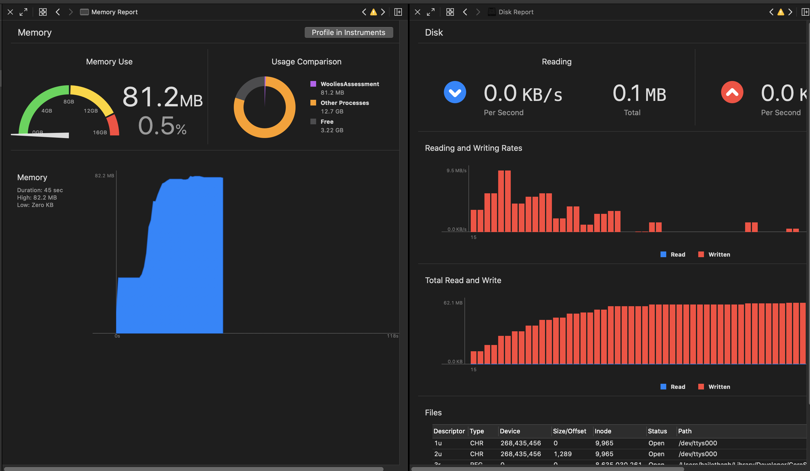
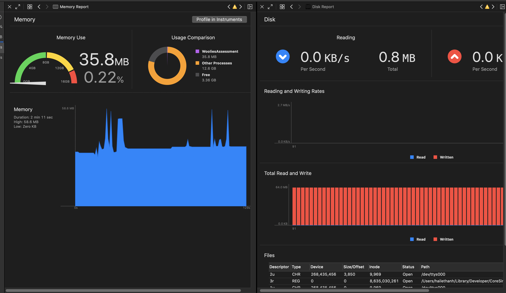
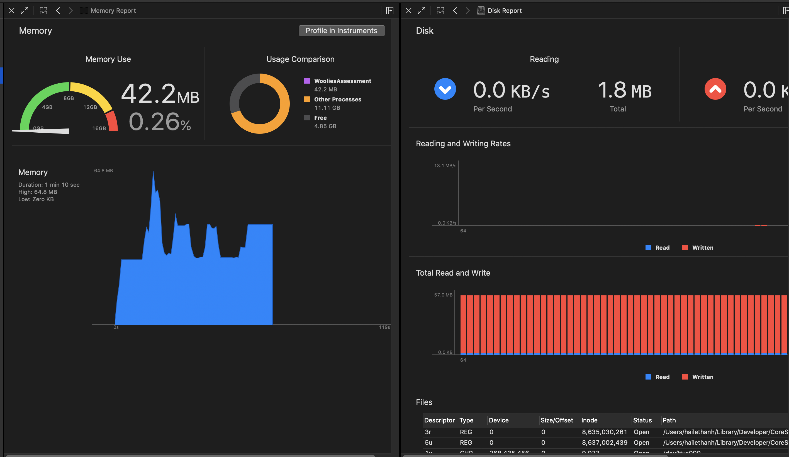

# WooliesX assessment

## Requirement

Develop a simple app, which call Restful API.

## Some important notes
- Not blocking user interaction when calling API requests.
- Caching images after loading from URL to reuse later.
- User scroll table view fast. Possibly the imaged loaded from previous view model, display on the cell which does not have the same view model, and causes incorrect data display on that cell.
- The memory used in the application should be reasonable.

## Solution
### Run non-UI specific tasks in background thread
`QueueManager` is the class used to managed operations, which run on background threads. In this class, its property `OperationQueue` will manage to run the operations in multiple threads. We can also configure `QueueManager` to run how many concurrent tasks.

Apart from `QueueManager`, we have `BaseOperation` class. This is the base class to define how an operation is executed, and when it is finished based on the `State`. Normally, a basic operation will finish when function `main` is finished. However, using this approach, when a URL operation executes, the `main` function will finish before the URL request returns response. Therefore, we need to define our own `State` to manually define the case when operation finish executing.

Therefore, when we subclass `BaseOperation` and override the function `main`, we need to call `copmlete` function, to tell the `QueueManager` that this operation is finished, so the `QueueManager` can execute other operations.

To run other tasks after the operations finish (like updating the UI, or view model), `BaseOperation` has `completionHandler` return the `Result` of that operation.

### Caching images
When fetching images from URL, we use `CacheImageOperation`. The instance of this class will fetch images from URL and store these images into physical files system (Caches/Download folder)

The operation caches images based on the name of the image, and save image with that name in the file system. Using this approach, when user restart the application and make the URL request. If the names of the images are the same with previous session, it will load the cached images instead of making other URL calls.

### Cancel caching image operation
When user scroll the table view super fast, the app will create multiple `CacheImageOperation` to download images for cells. Because the cells of table view are reused, so the reused cell still keep the previous closure of downloading image. This will cause the issue what the cell will display incorrect image of other viewModel.

To fix this issue, in the `prepareForReuse` function of `BreedTableViewCell`, we need to clear the reference between the current cell and previous viewModel.

Also, the caching image operation of the previous viewModel is not needed, because user have scrolled through that cell. Therefore, in the `tableView(_ tableView: UITableView, didEndDisplaying cell: UITableViewCell, forRowAt indexPath: IndexPath)` delegate function in `BreedsViewController`, we need to tell `presenter` to `stopRequestDataForCell`, so we can cancel caching image operation for previous cells.

### Fix memory issue
Because we cache image in memory as well, so when we scroll to the bottom of the screen, all of the images in previous cells have been cached, which contribute to huge amount of memory usage. The typical example in the screenshot:

The app uses about 81MB when scrolling up and down to view images. To fix this, there are some approaches:
1. When cell at location `N` disappear on the screen, we release the image attached to that cell.
2. When cell at location `N` disappear on the screen, we released the images attached to viewModel at location `N - x` and `N + x` with x is 10, 20, etc

- When implement the first approach, the memory usage has improved. However, because we release the image right after the cell disappears on screen, that means the application has to continuously access the file in the file system. That can cause energy impact for the device.

When implement the second approach (using x = 20), the memory usage also improved, obviously the memory usage is not as good as the first approach. Because we still keep around data of 18 images in the memory system. I prefer this approach because we decrease the number of times we need to access images in physical memory.

However, both of above approaches still have the issues when users scroll the table quickly, the app will continuously access to the file system, and if the image size is huge, it can cause performance issues to load and display that image on cell, too. The image files are in PNG format, some files have the size around 1-3MB, which leads to the memory issue of loading from physical memory and display in `UIImageView`

Above are some of my points when working on this application, feel free to comment to make the code better!
